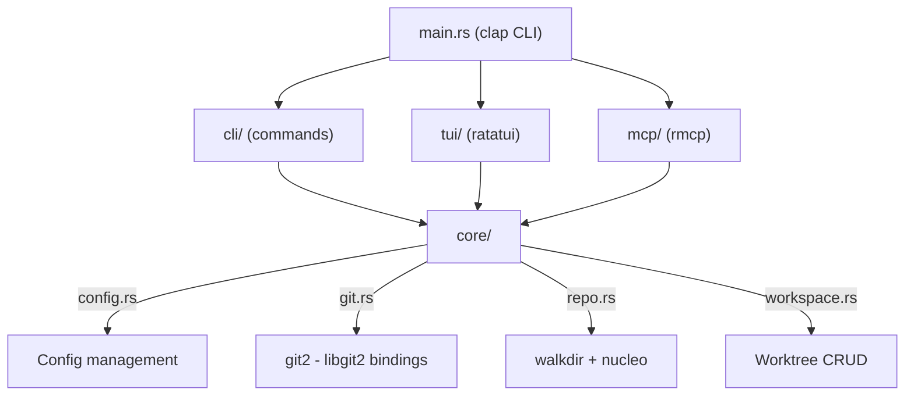
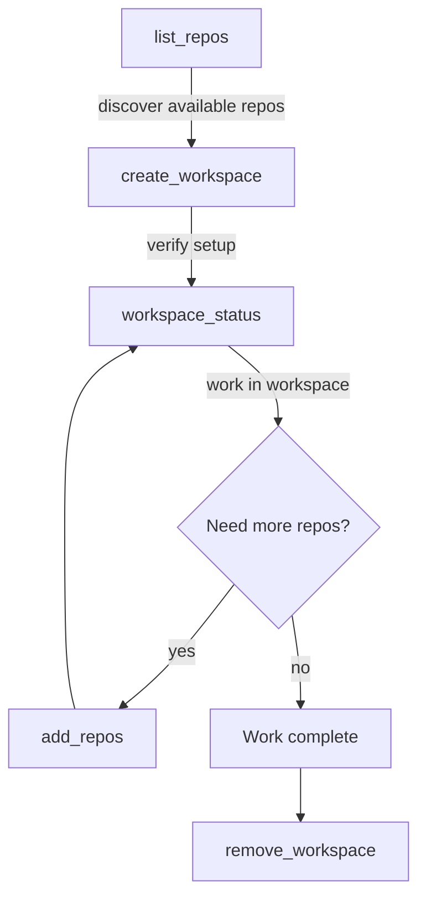

# space

A CLI workspace manager for multi-repo git worktrees.

**Repository:** [github.com/daderoode/space](https://github.com/daderoode/space)
**Version:** 0.6.1
**Install:** `brew install daderoode/tap/space`

Last updated: 2026-04-07

## Contents

- [Overview](#overview)
- [Features](#features)
- [Use Cases](#use-cases)
- [MCP Tools](#mcp-tools)
- [Configuration](#configuration)

---

# Overview

## The Problem

Working on features that span multiple repositories is painful. You need to:

- Create matching branches in each repo
- Switch between repos to check status, stage, commit
- Remember which repos are involved when you context-switch back to the feature
- Clean up all the branches and worktrees when you're done

Git worktrees help by letting you have multiple branches checked out simultaneously, but managing worktrees across many repos is still manual and error-prone.

## What space Does

`space` introduces the concept of a **workspace** -- a named group of repositories, all checked out on the same branch, living under a single directory. One command to set up, one to tear down.

```
~/workspaces/
  feature/auth-upgrade/
    api-service/          <-- git worktree
    shared-lib/           <-- git worktree
    web-frontend/         <-- git worktree
```

Each subdirectory is a git worktree pointing back to the original repo. The workspace name (`feature/auth-upgrade`) doubles as the default branch name.

## Three Interfaces

space exposes the same functionality through three interfaces:

### TUI Dashboard

Running `space` with no arguments opens an interactive terminal dashboard. Two panes: workspaces on the left, repo details on the right. Navigate with vim keys, create/delete workspaces, search repos -- all without leaving the terminal.

See [Features: TUI Dashboard](#tui-dashboard) for full details.

### CLI Commands

Direct commands for scripting and quick actions: `space ls`, `space go`, `space status`, `space rm --force`, etc.

See [Features: CLI Commands](#cli-commands) for the full command reference.

### MCP Server

`space mcp` starts a Model Context Protocol server on stdio, exposing 6 tools for AI agents to discover repos, create workspaces, check status, and clean up -- all programmatically.

See [MCP Tools](#mcp-tools) for the complete tool reference.

## How It Works Under the Hood

### Workspace = Directory of Worktrees

There is no metadata database. The filesystem **is** the state. A workspace is simply a directory under `workspaces.dir` (default `~/workspaces`). Each repo inside it is a git worktree.

### Creating a Workspace

When you create a workspace, space does this for each selected repo:

1. Runs `git fetch --quiet origin` on the main repo (errors silently ignored for offline use)
2. Determines the branch based on the chosen strategy:
   - **New branch:** checks for existing local branch first, then remote tracking branch, then creates off the base branch
   - **Existing branch:** strips `origin/` prefix if present, uses `--track` for remote branches
   - **Detached HEAD:** uses `--detach`
3. Runs `git worktree add <workspace_dir>/<workspace_name>/<repo_name> ...`

### Removing a Workspace

For each repo worktree in the workspace:

1. Reads the `.git` file to trace back to the main repository
2. Runs `git worktree remove` on the main repo
3. Deletes the workspace directory

### Repo Discovery

space scans configured root directories (default `~/projects`) using `walkdir` up to a configurable depth (default 3). It finds directories containing `.git`, filters out nested repos (submodules), and caches the results to `~/.config/space/repos.cache`.

The cache is a simple newline-delimited file of absolute paths. Refresh manually with `space repos --refresh` or the `r` key in the TUI.

## Architecture



- **core/** -- all business logic. Config management, git operations (via libgit2), repo discovery (via walkdir), workspace CRUD
- **cli/** -- command handlers that print output and emit cd targets
- **tui/** -- ratatui-based interactive UI with screens, widgets, and a custom theme
- **mcp/** -- MCP server exposing core functionality as JSON tools over stdio

---

# Features

## TUI Dashboard

Running `space` with no arguments opens an interactive terminal dashboard:

```
┌─ Workspaces (25%) ──────────┬─ my-feature (vs base) ────────────────────┐
│  my-feature                 │  ▶ api-service  feat/x  clean   +142 -20  │
│  hotfix-payment             │  ▼ sak          feat/x  2 modified  +38  -4 │
│  ...                        │    M src/main.rs          [staged]  +12 -4 │
│                             │    A src/new.rs            [staged]  +26 -0│
│                             │    ? untracked.txt                   +3  -0│
└─────────────────────────────┴───────────────────────────────────────────┘
 enter expand · ←/esc back · T switch to HEAD · q quit
```

### Layout

- **Left pane (25%):** Workspace list. Empty state shows "No workspaces yet".
- **Right pane (75%):** Repo table with columns: REPO, BRANCH, STATUS, +/-.
  - STATUS shows `clean` (green) or plain-language summaries like `3 modified, 1 new`.
  - +/- shows total file insertions/deletions vs the base branch in green/red.
  - Repos can be expanded (`→` or `Enter`) to show per-file diff rows beneath them. File rows show a status letter (M/A/D/R/?), file path, staged/unstaged indicator, and per-file +/- counts.
  - Pane title shows the active diff target: `(vs base)` or `(vs HEAD)`.
- **Status bar:** Context-sensitive key hints. Shows timed status messages (5-second TTL) when actions complete or fail.

### Diff Targets

The right pane can show two views, toggled with `T`:

| Mode | Shows |
|------|-------|
| **vs base** (default) | Total divergence from main/master — all committed + uncommitted changes |
| **vs HEAD** | Uncommitted changes only — staged and unstaged, with `[staged]`/`[unstaged]` badges |

### Key Bindings — Workspaces Pane

| Key | Action |
|-----|--------|
| `j` / `k` or `↑` / `↓` | Navigate workspaces |
| `→` or `Tab` | Focus repos pane |
| `Enter` | Go to selected workspace (cd into it) |
| `c` | Create new workspace |
| `a` | Add repos to selected workspace |
| `d` | Delete selected workspace |
| `g` | Go to workspace (fuzzy picker) |
| `r` | Refresh repo cache |
| `/` | Search all repos |
| `S` | Open config editor |
| `q` / `Esc` | Quit |
| `Ctrl-C` | Force quit (works on all screens) |

### Key Bindings — Repos Pane

| Key | Action |
|-----|--------|
| `j` / `k` or `↑` / `↓` | Navigate through repo rows and expanded file rows |
| `→` or `Enter` | Expand / collapse repo to show per-file diffs |
| `←` or `Esc` | Collapse all expanded repos; second press refocuses workspaces pane |
| `T` | Toggle diff target: base branch ↔ HEAD |
| `q` | Quit |

### Theme

Custom color palette:

| Color | Hex | Usage |
|-------|-----|-------|
| Teal | `#00BCB4` | Focused borders, title, accents |
| Mint | `#64DCB4` | Selected items, success indicators, clean status |
| Light Blue | `#82BEFF` | Branch names |
| Muted | `#646E78` | Dim text, separators, file paths |
| Error | `#FF6464` | Errors, danger borders, deletion counts |
| Warn | `#F0C850` | Modified status, unstaged file indicators |
| Staged Green | `#64DC82` | Insertion counts, staged file indicators |

---

## Create Workspace Flow

A 5-stage wizard launched by pressing `c` or running `space create`:

### Stage 1: Pick Repos

Multi-select fuzzy picker powered by nucleo. Type to filter, `Tab` to toggle selection, `Enter` to confirm. Status line shows `N selected  matched/total matched`.

**Scope filtering:** Type `orgname/` to filter repos whose parent directory contains "orgname", then fuzzy-match on the rest. Or press `Ctrl-S` to cycle through parent directory scopes.

If `space create repo-a repo-b` was used, those names pre-populate the search.

### Stage 2: Name Workspace

Text input for the workspace name. Supports full readline-style editing: `Ctrl-A`/`Ctrl-E` (home/end), `Ctrl-W` (delete word), `Ctrl-U` (delete line), `Ctrl-K` (delete to end).

### Stage 3: Pick Branch Strategy

Four options:

| Option | Behaviour |
|--------|-----------|
| New branch (name = workspace name) | Creates a fresh branch in each repo |
| Existing branch | Checks out a branch that already exists |
| Detached HEAD | No branch created -- for read-only exploration |
| Pick a branch... | Opens a branch picker (Stage 4) |

### Stage 4: Pick Branch (conditional)

Only shown if "Pick a branch..." was chosen. Fuzzy picker showing all local and remote branches from the first selected repo.

### Stage 5: Creating

Progress log showing each repo with a checkmark or error. If a "branch already checked out" error occurs, routes back to the strategy picker with an explanation rather than failing cryptically.

`Esc` at any stage goes back to the previous stage. `Esc` at Stage 1 returns to the dashboard.

---

## Add Repos Flow

4-stage wizard (same as Create minus the naming step). Launched by pressing `a` or running `space add <workspace> <repos>`. The fuzzy picker automatically excludes repos already in the workspace.

---

## Delete Workspace

Confirmation dialog showing `Delete workspace?`, the workspace name on its own line, and the worktrees that will be removed. Press `Enter` or `y` to delete, `n` or `Esc` to cancel. Long names are truncated with `...`, and long repo lists keep the footer visible by showing `... and N more` when needed. With `space rm --force`, skips the dialog entirely.

---

## Go / Fuzzy Workspace Picker

Pressing `g` or running `space go` opens a fuzzy picker listing all workspaces. Select one and press `Enter` to cd into it. The cd is communicated back to the shell via the [cd-target protocol](#shell-integration).

---

## Repo Search

Pressing `/` opens a fuzzy search across all cached repos. Matching is powered by nucleo (same engine as the Helix editor). Selecting a repo navigates to the workspace containing it.

---

## Config Editor

Pressing `S` or running `space config` opens a full-screen field editor:

| Field | Type | Description |
|-------|------|-------------|
| Workspaces dir | Path | Root directory for workspaces |
| Repo roots | Comma-separated paths | Directories to scan for repos |
| Max depth | Integer | How deep to scan |

Navigation: `j`/`k` between fields, `Enter` to edit, `Esc` to cancel edit, `Ctrl-S` to save and return to dashboard. Paths display with `~` and expand on save.

---

## CLI Commands

| Command | Aliases | Arguments | Description |
|---------|---------|-----------|-------------|
| `space` | -- | -- | Opens TUI dashboard |
| `space ls` | `list` | `-v`/`--verbose` | List workspaces. Verbose shows per-repo branch + status |
| `space go` | -- | `[name]` | cd into workspace. No name opens fuzzy picker |
| `space status` | `st` | `<name>` | Detailed per-repo status (branch, dirty state, ahead/behind) |
| `space create` | -- | `[repos...]` | Create workspace. Optional repo names pre-populate picker |
| `space add` | -- | `<workspace> <repos...>` | Add repos to existing workspace |
| `space rm` | `remove` | `<name>` `-f`/`--force` | Remove workspace. Force skips confirmation |
| `space repos` | -- | `-r`/`--refresh` | List discovered repos. Refresh rescans filesystem |
| `space config` | -- | -- | Open TUI config editor |
| `space completions` | -- | `zsh` | Print shell completions |
| `space init` | -- | `zsh` | Output shell init script (wrapper + completions) for eval |
| `space mcp` | -- | -- | Start MCP server on stdio |

---

## Fuzzy Finding

Powered by **nucleo 0.5** (the engine behind the Helix editor):

- Smart case matching (case-insensitive until you type uppercase)
- Smart Unicode normalization
- Character-level match highlighting in the UI
- Scope filtering by parent directory (`orgname/` prefix or `Ctrl-S` cycling)
- Multi-select with `Tab` toggle

Used in: repo picker, workspace picker, branch picker, and repo search.

---

## Repo Discovery and Caching

- Scans configured root directories using `walkdir`
- Respects `max_depth` setting (default 3)
- Filters out nested repos (submodule pattern: `.git` inside another `.git` tree)
- Does not descend into `.git` directories
- Cache stored at `~/.config/space/repos.cache` (newline-delimited paths)
- Refresh with `space repos --refresh`, the `r` key in the TUI, or `list_repos(refresh: true)` via MCP

> **Note:** The cache is automatically invalidated when older than `cache_age_secs` (default: 1 hour). A stale cache triggers a rescan on next use. You can also force a refresh with `space repos --refresh`, the `r` key in the TUI, or `list_repos(refresh: true)` via MCP.

---

# Use Cases

## Multi-Service Feature Work

**Scenario:** You're building a new auth flow that touches the API service, a shared library, and the web frontend.

```
space create api-service shared-lib web-frontend
```

The TUI walks you through naming the workspace (e.g. `feature/auth-upgrade`) and choosing a branch strategy. With "new branch", all three repos get a `feature/auth-upgrade` branch created from their respective base branches.

```
~/workspaces/feature/auth-upgrade/
  api-service/       <- worktree on feature/auth-upgrade
  shared-lib/        <- worktree on feature/auth-upgrade
  web-frontend/      <- worktree on feature/auth-upgrade
```

Your original checkouts stay untouched. `space go feature/auth-upgrade` drops you into the workspace directory. Work across all three repos, commit independently, and when you're done:

```
space rm feature/auth-upgrade
```

All worktrees removed, workspace directory cleaned up.

---

## Cross-Repo Refactoring

**Scenario:** Renaming a shared type that's used across 5 repos.

1. Open the TUI with `space`, press `c` to create
2. Use the fuzzy picker to select all 5 repos (type to filter, `Tab` to toggle)
3. Name the workspace `refactor/rename-user-to-account`
4. Choose "new branch" strategy

All 5 repos are now on the same branch in one directory. Make the rename, test each repo, commit, push, and open PRs -- all from one workspace.

---

## Reviewing Another Developer's Feature Branch

**Scenario:** A colleague has pushed `feature/payment-v2` across 3 repos and you need to review and test it locally.

```
space create
```

1. Select the 3 repos
2. Name the workspace `review/payment-v2`
3. Choose **"existing"** strategy
4. Enter branch name: `feature/payment-v2`

space checks out the existing branch in each repo. You can now build, run tests, and inspect the code. When you're done reviewing:

```
space rm review/payment-v2
```

No stale branches left behind since you didn't create any.

---

## Spike / Prototype

**Scenario:** You want to experiment with a new API design across two services without polluting your branches.

```
space create
```

1. Select the repos
2. Name: `spike/new-api-design`
3. Choose "new branch"

Prototype freely. If the spike is promising, push and open PRs. If not:

```
space rm spike/new-api-design
```

The branches are cleaned up with the worktrees.

---

## Read-Only Exploration

**Scenario:** You need to browse the code of several repos you're unfamiliar with, without creating any branches.

1. Create a workspace with **"detached HEAD"** strategy
2. Browse the code, run builds, read tests
3. Remove the workspace when done

No branch pollution. Good for onboarding or investigating unfamiliar areas.

---

## Hotfix Across Repos

**Scenario:** A production bug requires changes in 2 repos, and the hotfix branch already exists.

```
space create
```

1. Select the 2 repos
2. Name: `hotfix/payment-timeout`
3. Choose **"existing"** strategy
4. Enter branch: `hotfix/payment-timeout`

Fix the bug in both repos from the same workspace, then clean up.

---

## AI-Driven Workspace Management

**Scenario:** You're using an AI coding agent that needs to work across multiple repos.

The agent connects to `space mcp` (MCP server on stdio) and uses the tools programmatically:

1. **Discover repos:** `list_repos(refresh: true)` to see what's available
2. **Create workspace:** `create_workspace(name: "feature/add-metrics", repos: ["api", "dashboard"], strategy: "new")`
3. **Check status:** `workspace_status(name: "feature/add-metrics")` to verify branches and dirty state
4. **Add more repos later:** `add_repos(workspace: "feature/add-metrics", repos: ["shared-lib"])`
5. **Clean up:** `remove_workspace(name: "feature/add-metrics")`

The agent skill at `~/.config/opencode/skills/superpowers/using-space/` teaches AI agents when and how to use these tools. See [MCP Tools](#tools-reference) for the full tool reference.

---

## Quick Status Check

**Scenario:** You have several workspaces open and want to see what state they're in.

```
space ls -v
```

Shows each workspace with per-repo branch, modified/staged counts, and ahead/behind. Or open the TUI dashboard (`space`) for an interactive overview -- select a workspace on the left, see repo details on the right with green/red `+/-` line counts vs the base branch. Press `→` or `Enter` on any repo to expand it and see exactly which files changed.

Via MCP: `list_workspaces` returns the same information as JSON.

---

# MCP Tools

space exposes its workspace management capabilities as an MCP (Model Context Protocol) server. Start it with:

```sh
space mcp
```

This runs a stdio-transport MCP server. Connect to it from any MCP client (OpenCode, Claude Code, etc.) by configuring the command as `space mcp`.

**Server info:**
- Name: `space-mcp`
- Version: matches the `space` binary version
- Capabilities: tools

---

## Tools Reference

### list_repos

Discover git repositories from configured root directories.

**Parameters:**

| Name | Type | Default | Description |
|------|------|---------|-------------|
| `refresh` | `bool` | `false` | Rescan filesystem instead of using cache |

**Returns:** JSON array of `{ name, path }` objects.

**Example response:**

```json
[
  { "name": "api-service", "path": "/Users/me/projects/api-service" },
  { "name": "web-frontend", "path": "/Users/me/projects/web-frontend" },
  { "name": "shared-lib", "path": "/Users/me/projects/shared-lib" }
]
```

> **Tip:** Use `refresh: true` on first use or when repos may have been added/removed since last scan.

---

### list_workspaces

List all workspaces with per-repo branch and status information.

**Parameters:** None.

**Returns:** JSON array of workspace objects with nested repo details.

**Example response:**

```json
[
  {
    "name": "feature/auth",
    "path": "/Users/me/workspaces/feature/auth",
    "repos": [
      {
        "name": "api-service",
        "path": "/Users/me/workspaces/feature/auth/api-service",
        "branch": "feature/auth",
        "status": { "modified": 2, "staged": 0, "untracked": 1 },
        "ahead": 3,
        "behind": 0
      }
    ]
  }
]
```

---

### workspace_status

Get detailed status for a specific workspace.

**Parameters:**

| Name | Type | Required | Description |
|------|------|----------|-------------|
| `name` | `string` | Yes | Workspace name |

**Returns:** Single workspace object (same structure as `list_workspaces` entries).

**Errors:**
- Workspace not found -> `internal_error`

---

### create_workspace

Create a new workspace with git worktrees for selected repos.

**Parameters:**

| Name | Type | Default | Description |
|------|------|---------|-------------|
| `name` | `string` | -- | Workspace name (becomes a directory) |
| `repos` | `string[]` | -- | Repo names (matched case-insensitively against cache) |
| `strategy` | `string` | `"new"` | Branch strategy: `"new"`, `"existing"`, or `"detached"` |
| `branch` | `string?` | `null` | Branch name. Defaults to workspace name for `"new"`. Required for `"existing"` |

**Branch strategies:**

| Strategy | Behaviour |
|----------|-----------|
| `"new"` | Creates a new branch. Name defaults to `name` param, or set `branch` explicitly. Checks local branches first, then remote tracking, then creates off the base branch |
| `"existing"` | Checks out an existing branch. `branch` parameter is required. Strips `origin/` prefix, uses `--track` for remote branches |
| `"detached"` | Detached HEAD at default branch. No branch created |

**Returns:**

```json
{
  "name": "feature/my-work",
  "path": "/Users/me/workspaces/feature/my-work",
  "repos_created": ["api-service", "shared-lib"]
}
```

**Errors:**
- Repo not found in cache -> `invalid_params` with hint to refresh
- Ambiguous repo name (multiple paths with same basename) -> `invalid_params`
- Unknown strategy -> `invalid_params`
- `"existing"` without `branch` -> `invalid_params`
- Worktree creation failure (e.g. branch already checked out) -> `internal_error`

> **Warning:** Git does not allow the same branch to be checked out in two worktrees simultaneously. If you get a "branch already checked out" error, use `"existing"` strategy or choose a different branch name.

---

### add_repos

Add repos to an existing workspace.

**Parameters:**

| Name | Type | Default | Description |
|------|------|---------|-------------|
| `workspace` | `string` | -- | Existing workspace name |
| `repos` | `string[]` | -- | Repo names to add |
| `strategy` | `string` | `"new"` | Branch strategy (same options as `create_workspace`) |
| `branch` | `string?` | `null` | Branch name. Defaults to workspace name |

**Returns:**

```json
{
  "workspace": "feature/my-work",
  "added": ["web-frontend"]
}
```

**Errors:**
- Workspace not found -> `invalid_params`
- Same repo/strategy errors as `create_workspace`

---

### remove_workspace

Remove a workspace and all its git worktrees.

**Parameters:**

| Name | Type | Required | Description |
|------|------|----------|-------------|
| `name` | `string` | Yes | Workspace to remove |

**Returns:**

```json
{
  "removed": "feature/my-work"
}
```

> **Note:** This always uses force removal. Each repo's worktree is removed via `git worktree remove --force` on the main repository, then the workspace directory is deleted.

---

## Typical Agent Workflow



1. **Discover:** Call `list_repos(refresh: true)` to see what repos are available
2. **Create:** Call `create_workspace` with the repos you need and a descriptive name
3. **Verify:** Call `workspace_status` to confirm branches and clean state
4. **Expand:** Call `add_repos` if you discover you need more repos mid-task
5. **Clean up:** Call `remove_workspace` when work is merged, PR'd, or abandoned

---

## Repo Name Resolution

Repo names in `repos` parameters are matched **case-insensitively** against the basename (final directory component) of cached repo paths. For example, if the cache contains `/Users/me/projects/Api-Service`, passing `"api-service"` will match it.

If two repos in different root directories have the same basename, the call will fail with an "ambiguous" error listing the conflicting paths. In this case, rename one of the repos or restructure your roots.

---

## Error Patterns

| Error | Cause | Resolution |
|-------|-------|------------|
| "repo 'X' not found in cache" | Repo not discovered or cache stale | Call `list_repos(refresh: true)` then retry |
| "repo 'X' is ambiguous" | Multiple repos with same basename | Rename repo or adjust configured roots |
| "branch name is required when strategy is 'existing'" | Missing `branch` param | Add `branch` parameter |
| "unknown strategy 'X'" | Invalid strategy string | Use `"new"`, `"existing"`, or `"detached"` |
| "failed to create worktree for X: ..." | Git-level error (branch checked out, etc.) | Check the error detail -- usually means the branch is already checked out elsewhere |

---

# Configuration

## Installation

```sh
brew install daderoode/tap/space
```

macOS only (aarch64 and x86_64). Release binaries are published to GitHub Releases as `.tar.gz` with SHA256 checksums.

---

## Shell Integration

Add to your `~/.zshrc`:

```zsh
eval "$(space init zsh)"
```

This sets up two things:

1. **Shell wrapper** — intercepts TUI/cd commands so `space go` can change your working directory and TUI commands render correctly
2. **Tab completions** — registers the zsh completion function for all subcommands

If you installed via Homebrew, completions are also installed to
`$(brew --prefix)/share/zsh/site-functions/_space` — they work without
the `eval` line if that directory is on your `$fpath`.

### How the wrapper works

The binary can't `cd` your shell directly. The wrapper creates a temp file,
sets `__SPACE_CD_FILE__` in the environment, runs the binary, then `cd`s to
whatever path the binary wrote to that file.

For read-only commands (`ls`, `status`, `repos`, etc.) the wrapper passes
through directly — no temp file needed.

### Manual completions install

If you prefer to install completions to a custom location:

```sh
space completions zsh > ~/.zfunc/_space
```

Ensure `~/.zfunc` is on your `$fpath` (add `fpath=(~/.zfunc $fpath)` before
`compinit` in `~/.zshrc`).

---

## Config File

On first run, space writes defaults to `~/.config/space/config.toml`:

```toml
[repos]
roots = ["~/projects"]
max_depth = 3
cache_age_secs = 3600

[workspaces]
dir = "~/workspaces"
```

Edit interactively with `space config` (or press `S` in the TUI), or edit the file directly.

### All Options

| Section | Key | Type | Default | Description |
|---------|-----|------|---------|-------------|
| `[repos]` | `roots` | Array of paths | `["~/projects"]` | Directories to scan for git repositories |
| `[repos]` | `max_depth` | Integer | `3` | Maximum directory depth when scanning for repos |
| `[repos]` | `cache_age_secs` | Integer | `3600` | Cache TTL in seconds; stale caches are automatically discarded |
| `[workspaces]` | `dir` | Path | `~/workspaces` | Root directory where workspaces are created |

> **Tip:** Multiple repo roots are supported. Separate with commas in the TUI config editor, or use TOML array syntax in the file: `roots = ["~/projects", "~/work", "~/oss"]`

---

## File Locations

| File | Path | Description |
|------|------|-------------|
| Config | `~/.config/space/config.toml` | All settings |
| Repo cache | `~/.config/space/repos.cache` | Newline-delimited list of discovered repo paths |
| Workspaces | `~/workspaces/` (configurable) | Root directory containing all workspace directories |

The config directory follows `dirs::config_dir()`, which respects `$XDG_CONFIG_HOME` if set.

---

## MCP Server Configuration

To use the MCP server with an AI coding agent, add it to your agent's MCP config. For example, in OpenCode:

```json
{
  "mcpServers": {
    "space": {
      "command": "space",
      "args": ["mcp"]
    }
  }
}
```

The server runs on stdio (stdin/stdout). Logs go to stderr at INFO level. No additional configuration is needed -- the server reads the same `config.toml` as the CLI.

---

## Development

Before pushing changes:

```sh
cargo fmt --check
cargo clippy -- -D warnings
cargo test
```

CI runs the same checks on every push to `master` and all PRs (macOS runner).
