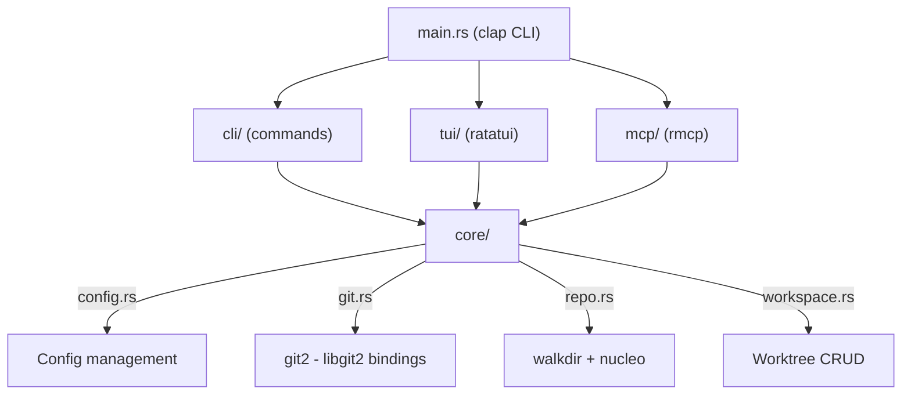
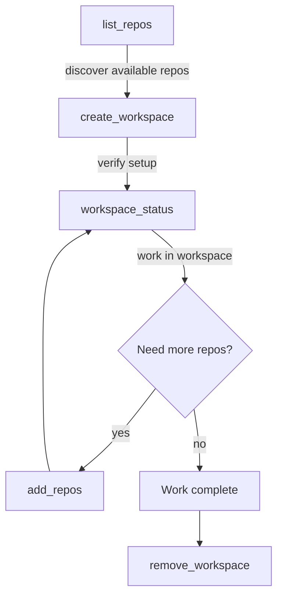

# space

A CLI workspace manager for multi-repo git worktrees.

**Repository:** [github.com/daderoode/space](https://github.com/daderoode/space)
**Version:** 0.6.1
**Install:** `brew install daderoode/tap/space`

Last updated: 2026-04-07

## Contents

- [Overview](#overview)
- [Features](#features)
- [Use Cases](#use-cases)
- [MCP Tools](#mcp-tools)
- [Configuration](#configuration)

---

# Overview

## The Problem

Working on features that span multiple repositories is painful. You need to:

- Create matching branches in each repo
- Switch between repos to check status, stage, commit
- Remember which repos are involved when you context-switch back to the feature
- Clean up all the branches and worktrees when you're done

Git worktrees help by letting you have multiple branches checked out simultaneously, but managing worktrees across many repos is still manual and error-prone.

## What space Does

`space` introduces the concept of a **workspace** -- a named group of repositories, all checked out on the same branch, living under a single directory. One command to set up, one to tear down.

```
~/workspaces/
  feature-auth-upgrade/
    api-service/          <-- git worktree
    shared-lib/           <-- git worktree
    web-frontend/         <-- git worktree
```

Each subdirectory is a git worktree pointing back to the original repo. The workspace name (`feature-auth-upgrade`) doubles as the default branch name. A name is one plain path component: no `/` or `\`, no leading `-` or `.`, not empty (see [Stage 1](#stage-1-name-the-space)).

## Three Interfaces

space exposes the same functionality through three interfaces:

### TUI Dashboard

Running `space` with no arguments opens an interactive terminal dashboard. Two panes: workspaces on the left, repo details on the right. Navigate with vim keys, create/delete workspaces, search repos -- all without leaving the terminal.

See [Features: TUI Dashboard](#tui-dashboard) for full details.

### CLI Commands

Direct commands for scripting and quick actions: `space ls`, `space go`, `space status`, `space rm --force`, etc.

See [Features: CLI Commands](#cli-commands) for the full command reference.

### MCP Server

`space mcp` starts a Model Context Protocol server on stdio, exposing 6 tools for AI agents to discover repos, create workspaces, check status, and clean up -- all programmatically.

See [MCP Tools](#mcp-tools) for the complete tool reference.

## How It Works Under the Hood

### Workspace = Directory of Worktrees

There is no metadata database. The filesystem **is** the state. A workspace is simply a directory under `workspaces.dir` (default `~/workspaces`). Each repo inside it is a git worktree.

### Creating a Workspace

When you create a workspace, space does this for each selected repo, except a repo whose place in the workspace already holds a worktree of that repo, which is left as it is (no fetch, no `git worktree add`):

1. Runs `git fetch --quiet origin` on the main repo (errors silently ignored for offline use), unless the strategy reads no remote ref, in which case the fetch is skipped. The rule: a detached HEAD skips, and an existing-branch name skips when it names a local branch (`refs/heads/<name>` exists). Everything else fetches: a new branch, an `origin/...` name, a name that exists only on origin (git resolves it to `origin/<name>` and tracks it), a tag name. Another remote's `<remote>/<name>` skips too, since a fetch of origin does not move that remote's refs, unless `remote.origin.fetch` writes under that remote's `refs/remotes/<remote>/`. A repo whose `remote.origin.fetch` refspec writes into `refs/heads/*` fetches whatever the strategy, because there the fetch moves local branches. Over MCP no sync runs first, so after a skipped fetch the repo's `origin/*` refs are as old as its last fetch; `workspace_status` compares each worktree's branch against `origin/<branch>`, or, for a branch that tracks its namesake on another remote (a branch made from `upstream/<branch>` does), against that remote's `<branch>`; a branch that tracks anything else on a remote other than origin, or whose tracking cannot be read, shows 0 and 0 (a detached worktree compares against `origin/HEAD`, when the clone has one). In the TUI the sync report ([Stage 3](#stage-3-sync-report)) runs a fetch first, so this one is also skipped for a repo whose sync fetch worked, or timed out, or took 5 seconds or more to fail; the Creating log says so for the last two.
2. Determines the branch based on the chosen strategy. `<base>` below is the name of the source repo's current `HEAD`: its checked-out branch, `HEAD` itself when it is detached or not on a local branch, or `main` when it has no commit yet:
   - **New branch:** checks for a local branch `refs/heads/<name>` first, then a remote-tracking branch `refs/remotes/origin/<name>`, then creates off `refs/remotes/origin/<base>`, or `refs/heads/<base>` when that ref does not exist. A tag or other ref of the same name never counts and is never checked out
   - **Existing branch:** `<remote>/<name>`, for `origin` or any remote the repo has configured (the longest remote name wins when one is a prefix of another), becomes a new local `<name>` tracking it (`--track`), read as `refs/remotes/<remote>/<name>`, so a tag of that name is ignored. For a remote other than origin, a local branch named by the whole string (`alice/fix` beside a remote `alice`) wins and is checked out instead, git's own precedence; `origin/<name>` is always the tracking form, whatever local branch exists. In the tracking form, a repo that already has a local branch of the stripped name `<name>` refuses with git's `a branch named '<name>' already exists`, whatever that branch tracks. Any other name goes to `git worktree add` as it is, and git decides: a local branch of that name is checked out; otherwise a tag, a commit ID or any other ref of that name is checked out detached, even when a remote has a branch of that name; otherwise a branch of that name on exactly one remote, or on the one `checkout.defaultRemote` names, becomes a new local branch tracking it; otherwise git fails
   - **Detached HEAD:** uses `--detach` at `refs/heads/<base>`, so each worktree starts at its source repo's current commit and a tag named like the branch is ignored; a source repo that is itself detached, or whose `HEAD` points at something that is not a local branch, gives `HEAD`. In the second case git refuses to create a branch in such a repo (`HEAD not found below refs/heads!`), so New branch and every form of Existing branch that creates one fail there; Detached HEAD and checking out a branch that already exists locally work
3. Runs `git worktree add <workspace_dir>/<workspace_name>/<repo_name> ...`

### Removing a Workspace

Each directory in the workspace (symlinks are left alone, neither sorted nor handed to git) is sorted into one of six kinds. Every directory is sorted before any of them is acted on, because removing one worktree can change what a second one looks like: two directories can name the same admin directory, and the second would no longer read as a worktree once the first had taken it.

1. **A worktree.** Its `.git` file names an admin directory that is still there and holds a `commondir`, which is what a linked worktree has and a submodule checkout does not. A relative `gitdir:`, which git writes when `worktree.useRelativePaths` is set, is read against the worktree, the way git reads it
2. **An orphan.** Its `.git` file names an admin directory that has gone, in the shape git writes for a worktree (a path ending in `worktrees/<id>` inside the source repo's git directory), and the source repo that path names has gone too, because it was deleted or moved
3. **No record.** Its `.git` file names an admin directory that has gone while the source repo is still there: a copy of a worktree whose original was removed (a space duplicated with `cp -R`, or a copy whose `.git` was edited by hand), a worktree whose record was pruned, or one whose source repo was cloned again at the same path. Nothing on disk says what it holds or ties it to an original, so it is kept, and the error says to keep what you need and delete it by hand
4. **A repository of its own**, which `space` never creates: a clone dropped in by hand, a bare repo, or a submodule checkout. A repository is recognised by the `objects` directory and `config` file that every repository has, in any format, rather than by asking a library, which would answer "not a repository" for a format it does not know and so delete it
5. **Unreadable**: its `.git` file cannot be read or does not name a gitdir; or, read as git does not read it, it names something: its path trimmed or its first line alone names anything that is there, or a blank-separated word of that line is a worktree path of a repository that is there, which a second line, a note beside the path, or blanks around it produce; or it names, by an absolute path, something that does not exist and is not in the form git writes an absolute gitdir in (ending in `worktrees/<id>`, with no `..` and no line break), so where its source repo would be cannot be told; or it names a worktree of a directory that is not a git repository, or a missing git directory that leaves another repository's `worktrees` directory into a name that is not there (a note glued to the path reads like that). A relative `gitdir:` that leads nowhere is kept by its own rule, described below the list
6. **Plain content**: no repository here at all. Only the directories directly inside the workspace are sorted; a repository nested deeper, such as a clone at `notes/inner`, is not looked for and goes with its parent

For each worktree, `git worktree remove` (with `--force`, which every command in the app passes) runs inside the worktree itself, so git resolves the source repo, and its output is captured rather than let through to the terminal. Only once every directory has been dealt with, and nothing has been kept, is the workspace directory deleted, with the plain content in it.

A worktree git refuses to give up keeps the whole workspace: the worktrees git already removed are gone, but the workspace directory itself is not deleted, and the error names each directory kept along with git's own reason. A worktree whose directory was moved or renamed by hand is refused too, and the error names the `git worktree repair` that fixes it. With `worktree.useRelativePaths` set, a moved space cannot be told apart from a deleted source repo, since a relative link breaks when either side moves, so such a worktree is kept rather than treated as an orphan, and the error names the `git worktree repair` to run from the source repo if either was moved, or says to delete the directory by hand if the source repo is gone. A worktree and a copy of it sitting in the same space share one admin directory; neither is removed, because removing the original would leave the copy with nothing registered, which git can no longer read, so both are kept and reported as a pair, and the summary leads with their count. A copy in another space, such as a whole space duplicated with `cp -R`, is not grouped: removing the original's space goes ahead, git refuses the copy while the original is there, and once the original is gone the copy is kept as having no record, so no order of removals deletes it while its source repo stays where it is. Which of them is the original is read from what git recorded, never assumed: in a space moved by hand neither is where git recorded it, and both are told the repair that fixes a move and to keep their work before deleting anything. The common case is a worktree locked with `git worktree lock`, where the error also names the `git worktree unlock` that clears it, since `space` will not override a lock. The one lock it does override is on a worktree whose `git worktree add` never finished its checkout: git locks a worktree while adding it and unlocks it once the checkout returns, and the checkout writes its index last, so a locked worktree with an `index.lock` and no index is one whose add was killed mid-checkout (or the machine lost power). A forced removal passes `git worktree remove --force --force` for that worktree alone, since its tree holds nothing git handed over. A lock on a worktree that has an index is never overridden, whatever reason it carries. A repository of its own is kept for the same reason, because deleting it would take its history with it, and so is an unreadable one, because what it is cannot be told. An orphan is not a refusal when the removal is forced, which is every command in the app: git has nothing left to unregister, so that directory goes with the rest, and it is listed in the report if something else in the space was kept. On a removal that succeeds there is no report, and nothing is said about it. Unforced, which only the library API can ask for, an orphan is kept too, because git is no longer there to say whether it holds uncommitted work.

### Repo Discovery

space scans configured root directories (default `~/projects`) using `walkdir` up to a configurable depth (default 3). It finds directories containing `.git`, filters out nested repos (submodules), and caches the results to `~/.config/space/repos.cache`.

The cache is a simple newline-delimited file of absolute paths. Rescan manually with `space repos --refresh` or the `r` key in the TUI.

## Architecture



- **core/** -- all business logic. Config management, git operations (via libgit2), repo discovery (via walkdir), workspace CRUD
- **cli/** -- command handlers that print output and emit cd targets
- **tui/** -- ratatui-based interactive UI with screens, widgets, and a custom theme
- **mcp/** -- MCP server exposing core functionality as JSON tools over stdio

---

# Features

## TUI Dashboard

Running `space` with no arguments opens an interactive terminal dashboard:

```
┌─ Workspaces (25%) ──────────┬─ my-feature ──────────────────────────────┐
│  my-feature                 │  ▶ api-service  feat/x  clean   +142 -20  │
│  hotfix-payment             │  ▼ sak          feat/x  2 modified  +38  -4 │
│  ...                        │  ── Unstaged ──────────────────────────── │
│                             │    M src/main.rs                   +12 -4 │
│                             │    ? untracked.txt                  +3  -0│
│                             │  ── Staged ────────────────────────────── │
│                             │    A src/new.rs                    +26 -0 │
└─────────────────────────────┴───────────────────────────────────────────┘
 enter expand · ←/esc back · s/space stage · q quit
```

### Layout

- **Left pane (25%):** Workspace list. Empty state shows "No workspaces yet".
- **Right pane (75%):** Repo table with columns: REPO, BRANCH, STATUS, +/-.
  - STATUS shows `clean` (green) or plain-language summaries like `3 modified, 1 new`.
  - +/- shows total file insertions/deletions vs the base branch in green/red.
  - Repos can be expanded (`→` or `Enter`) to show per-file diffs. Expanded repos group files into **Conflicts**, **Unstaged**, and **Staged** sections. File rows show a status letter (M/A/D/R/?/!), the file path, and per-file +/- counts. Files with only some hunks staged show a `[partial]` badge; conflicts show `[conflict]`.
- **Status bar:** Context-sensitive key hints. Shows timed status messages (5-second TTL) when actions complete or fail.

### Diff Viewer

Press `Enter` on a file row in the expanded repo list to open a full-screen scrollable diff viewer showing the unified diff for that file. Hunks are syntax-colored: green for additions, red for deletions, dimmed for context lines.

- **Navigation:** `j`/`k` or `↑`/`↓` scroll line by line. `PgUp`/`PgDn` page through the diff. `Home`/`End` jump to start/end.
- **Staging:** Press `s` or `space` to stage or unstage the viewed file. The viewer returns to the dashboard after staging.
- **Closing:** `Esc` or `q` returns to the dashboard.

### Key Bindings — Workspaces Pane

| Key | Action |
|-----|--------|
| `j` / `k` or `↑` / `↓` | Navigate workspaces |
| `→` or `Tab` | Focus repos pane |
| `Enter` | Go to selected workspace (cd into it) |
| `c` | Create new workspace |
| `a` | Add repos to selected workspace |
| `d` | Delete selected workspace |
| `g` | Go to workspace (fuzzy picker) |
| `PgUp` / `PgDn` | Page up / down |
| `Home` / `End` | First / last workspace |
| `/` | Filter spaces (selects in place) |
| `S` | Open config editor |

`Esc` does nothing on this pane. It means "back", and the workspaces pane is the
top of the navigation tree, so there is nowhere to go back to. Quitting is `q`
or `Ctrl-C` only.

`c`, `a` and `d` act on the selected space, so they fire on this pane only and
do nothing on the repos pane. `r` is not a workspace-pane key: it rescans the
repo list and reloads the repos pane, so it works from either pane and is listed
under the general bindings below.

### Key Bindings — Repos Pane

| Key | Action |
|-----|--------|
| `j` / `k` or `↑` / `↓` | Navigate through repo rows and expanded file rows |
| `→` or `Enter` (on repo row) | Expand / collapse repo to show per-file diffs |
| `Enter` (on file row) | Open scrollable diff viewer |
| `←` or `Esc` | Collapse all expanded repos; second press refocuses workspaces pane |
| `h` | Scroll table left |
| `l` | Scroll table right |
| `s` or `space` | Stage / unstage file |
| `S` | Stage all unstaged files in repo |
| `U` | Unstage all staged files in repo |
| `b` | Switch branch for selected repo |
| `G` | Git operations for selected repo (fetch, pull, push, commit, log, rebase). Pull fetches origin and merges `origin/<name>`, or, for a branch that tracks its namesake on another remote (one made from `upstream/<name>`), fetches that remote and merges `upstream/<name>`; a branch that tracks anything else on a remote other than origin (a branch of another name, two branches, a remote the repo does not have), or whose tracking cannot be read, is refused with a sentence saying so, and nothing runs. Push runs `git push` at once for a branch whose push destination is origin; a branch that pushes elsewhere (one made from `upstream/<name>` tracks `upstream`, and a bare push goes there) asks `Branch <name> tracks upstream/<name>. Push to upstream?` first, as does a branch whose push destination cannot be read (`where a push goes could not be read. Push anyway?`) or is the repository itself (`branch.<name>.remote` is `.`); a branch with no upstream asks before `push -u origin`; all default to No |
| `PgUp` / `PgDn` | Page up / down |
| `Home` / `End` | First / last row |
| `/` | Search all repos |

### Repo Picker Key Bindings (create and add flows)

| Key | Action |
|-----|--------|
| `↑` / `↓` | Move the highlight (every letter types into the filter) |
| `Tab` | Toggle the highlighted repo |
| `Ctrl-S` | Cycle the parent-directory scope |
| `Ctrl-R` | Rescan the repo list without leaving the picker |

### Key Bindings, general (either pane)

| Key | Action |
|-----|--------|
| `r` | Rescan the repo list and reload the repos pane |
| `?` | Open help overlay (not while typing) |
| `F1` | Open help overlay (works while typing, e.g. in a picker) |
| `q` | Quit |
| `Ctrl-C` | Force quit (works on all screens) |

### Key Bindings — Diff Viewer

| Key | Action |
|-----|--------|
| `j` / `k` or `↑` / `↓` | Scroll up / down |
| `PgUp` / `PgDn` | Page scroll |
| `Home` / `End` | Jump to start / end |
| `s` or `space` | Stage / unstage file |
| `Esc` / `q` | Close viewer |

### Theme

Custom color palette:

| Color | Hex | Usage |
|-------|-----|-------|
| Teal | `#00BCB4` | Focused borders, title, accents |
| Mint | `#64DCB4` | Selected items, success indicators, clean status |
| Light Blue | `#82BEFF` | Branch names |
| Muted | `#646E78` | Dim text, separators, file paths |
| Error | `#FF6464` | Errors, danger borders, deletion counts |
| Warn | `#F0C850` | Modified status, warnings, [partial] badge |
| Staged Green | `#64DC82` | Insertion counts |

---

## Create Workspace Flow

A 6-stage wizard launched by pressing `c` or running `space create`. Stage 5 appears only for `New branch` and the branch picker:

### Stage 1: Name the Space

Text input for the workspace name (`Enter workspace name:`). Supports full readline-style editing: `Ctrl-A`/`Ctrl-E` (home/end), `Ctrl-W` (delete word), `Ctrl-U` (delete line), `Ctrl-K` (delete to end).

The name becomes a directory under `workspaces.dir` and the default branch name, so it must be one plain path component: not empty, no `/` or `\`, no leading `-` or `.`, no control or invisible formatting characters (leading and trailing whitespace is trimmed). Interior spaces, dots and non-ASCII are fine, except the invisible joiners and marks some scripts use (a zero-width joiner in an emoji sequence, the zero-width non-joiner in Persian), which are refused because they make two names look alike. A name that breaks the rule stays in the field and the dialog says which clause it broke; nothing is rewritten. The branch name typed at the "new branch" stage is checked with `git check-ref-format --branch` before anything is created, and a refusal shows git's own sentence (for example `'-x' is not a valid branch name`).

### Stage 2: Pick Repos

Multi-select fuzzy picker powered by nucleo. Type to filter, `Tab` to toggle selection, `Enter` to confirm. Status line shows `N selected  matched/total matched`.

**Scope filtering:** Type `orgname/` to filter repos whose parent directory contains "orgname", then fuzzy-match on the rest. Or press `Ctrl-S` to cycle through parent directory scopes.

If `space create repo-a repo-b` was used, the picker opens with `repo-a` and `repo-b` already toggled on and the query row empty. Each name must be one repo's directory name exactly as `space repos` lists it (case-sensitive); the shell completion offers those names. A name that matches no repo stops the command before the TUI opens; so does a name that matches several (two roots holding a repo of the same name), listing their paths. The names are not a search: to filter, run `space create` and type in the picker.

### Stage 3: Sync Report

`Enter` on the picker fetches each selected repo from `origin` and fast-forwards its local branches that are strictly behind `origin/<branch>`, or, for a branch that tracks its namesake on another remote, strictly behind that remote's `<branch>` as of that remote's last fetch (the sync fetches origin only); branches that are ahead, diverged or checked out are left as they are, and so is a branch that tracks anything else on a remote other than origin or whose tracking cannot be read. The report has one row per repo and is titled `Sync report · N of M` while it runs, then `Sync report · N ok` or `Sync report · N ok, M failed`. It waits for `Enter`, which works once every repo is done. A failed fetch does not stop the create: `Enter` still continues, and the branch choices come from local refs, which may be behind origin. `Esc` returns to Pick Repos with the selection and query intact; a sync that is still running stops before its next git call.

### Stage 4: Pick Branch Strategy

| Option | Behaviour |
|--------|-----------|
| `New branch '<name>'` | Asks for the branch name (Stage 5), then puts each repo on that branch, creating it where it does not exist yet; a tag or other ref of that name is not a branch and does not count: the branch is created beside it |
| `Existing branch '<name>' (if present)` | Uses the space name as the branch in each repo, resolved by git as described in [Creating a Workspace](#creating-a-workspace): a local branch of that name is checked out, and a tag of that name, when there is no local branch, gives a detached worktree. The space name must pass `git check-ref-format --branch`, checked when you choose this option |
| `Detached HEAD` | No branch created: each worktree is detached at its source repo's current commit (see [Creating a Workspace](#creating-a-workspace)). For read-only exploration |
| `Pick a branch...` | A heading over up to five local branches, the most recently committed ones: `Enter` on one uses it in every repo, and `Show more...` below them opens the branch picker (Stage 5). When there are no local branches to list, `Pick a branch...` opens the picker itself |

The branches listed here and in the picker come from one repo: the selected repo whose name sorts first.

### Stage 5: Branch Name or Pick Branch (conditional)

`New branch` opens a text input (`New branch name:`), filled in with the space name. While the field reads the space name, or nothing, it follows the space name: going back to Stage 1 and renaming the space renames the branch too, and a field you emptied is filled in again. A branch name you typed that differs from the space name is kept. `Show more...` (or `Pick a branch...` with no local branches) opens a fuzzy picker of all local and remote branches of that one repo. The branch picked is used in every repo. A branch picked as `<remote>/<name>`, from `origin` or any other remote the repo has configured (`upstream/<name>`), is checked out as a new local `<name>` tracking it, which git refuses in a repo that already has a local `<name>`, whichever remote that one tracks; pick `<name>` itself when the picker lists it. When the picker lists a local branch of that whole name too (`alice/fix` beside a remote `alice`), the local branch wins for any remote but origin: both rows check out the local branch, and the tracking form is not reachable from the picker in that repo (`git checkout -b fix --track refs/remotes/alice/fix` is the route; the bare `alice/fix` is ambiguous there and git refuses it).

### Stage 6: Creating

Progress log showing each repo with a checkmark or error. A repo whose place in the space already holds a worktree of that repo is left as it is, with no fetch and no `git worktree add`, and its row reads `✓ <repo> (already created)`; it counts as created. A worktree of that repo whose `git worktree add` never finished (its admin directory still locked from the add, with the checkout's `index.lock` and no index) is neither adopted nor attempted: its row fails with the reason and says to remove the space and create it again, or to run `git worktree remove -f -f <path>` in the repo; nothing on disk is touched. When no repo failed, the flow returns to the dashboard with the space selected, and the status message reads `Created workspace '<name>'`, `Created space; N of M repos were already in place` when some repos were already there, or `Nothing created: all M repos were already in this space` when all were. When a repo failed, the log stays up so it can be read, except for a "branch already checked out" error, which stops the run at that repo and routes back to the strategy picker with an explanation rather than failing cryptically.

`Esc` goes back one stage, except at three points: at Stage 1 it returns to the dashboard; at Stage 4 it returns to Pick Repos, past the sync report; and at Stage 6 it leaves for the dashboard, stopping the run first if it is still going (the worktrees already made stay, and the status message says how many).

---

## Add Repos Flow

5-stage wizard (same as Create minus the naming step). Launched by pressing `a` or running `space add <workspace> <repos>`; the repo names follow the same exact-name rule as `space create` and open the picker with those repos toggled on; a name the workspace already holds stops the command before the TUI opens. The fuzzy picker automatically excludes repos already in the workspace.

---

## Delete Workspace

Confirmation dialog showing `Delete workspace?`, the workspace name on its own line, and the worktrees that will be removed. The dialog defaults to No, like the push and rebase confirmations: only `y` or `Y` deletes, while `n`, `N`, `q`, `Enter` and `Esc` all cancel. Long names are truncated with `...`, and long repo lists keep the footer visible by showing `... and N more` when needed. With `space rm --force`, skips the dialog entirely.

If git refuses to remove one of the worktrees, the workspace stays where it is and the status message names the kept repos and the first reason, on one line; the whole report, repo by repo, goes to the log file when logging is on (it is by default; see `SPACE_LOG`). The dashboard is refreshed either way, since the worktrees git did remove are gone from disk. The dialog lists the repo directories `space` can see, which is every directory holding a `.git`; a bare repo has none, so one sitting in the workspace is not listed even though the removal will stop on it.

---

## Go / Fuzzy Workspace Picker

Pressing `g` or running `space go` opens a fuzzy picker listing all workspaces. Select one and press `Enter` to cd into it. The cd is communicated back to the shell via the [cd-target protocol](#shell-integration).

---

## Repo Search

Pressing `/` **on the repos pane** opens a fuzzy search across all cached repos. Matching is powered by nucleo (same engine as the Helix editor). Selecting a repo navigates to the workspace containing it. From the workspaces pane, `/` is the space filter instead (see below), so repo search from there is `→` then `/`.

## Space Filter

Pressing `/` **on the workspaces pane** opens a fuzzy picker over the spaces and selects the chosen one in place, without leaving the TUI. Focus stays on the workspaces pane and the repos pane reloads for the new space. This is the difference from `g`, which changes directory and exits.

---

## Config Editor

Pressing `S` or running `space config` opens a full-screen field editor:

| Field | Type | Description |
|-------|------|-------------|
| Workspaces dir | Path | Root directory for workspaces |
| Repo roots | Comma-separated paths | Directories to scan for repos |
| Max depth | Integer | How deep to scan |

Navigation: `j`/`k` between fields, `Enter` to edit, `Esc` to cancel edit, `Ctrl-S` to save and return to dashboard. Paths display with `~` and expand on save.

---

## CLI Commands

| Command | Aliases | Arguments | Description |
|---------|---------|-----------|-------------|
| `space` | -- | -- | Opens TUI dashboard |
| `space ls` | `list` | `-v`/`--verbose` | List workspaces. Verbose shows per-repo branch + status |
| `space go` | -- | `[name]` | cd into workspace. No name opens fuzzy picker |
| `space status` | `st` | `<name>` | Detailed per-repo status (branch, dirty state, ahead/behind) |
| `space create` | -- | `[repos...]` | Create workspace. Optional exact repo names (as `space repos` lists them) open the picker with those repos selected |
| `space add` | -- | `<workspace> <repos...>` | Add repos to existing workspace. Same exact-name rule as `space create` |
| `space rm` | `remove` | `<name>` `-f`/`--force` | Remove workspace. Force skips confirmation |
| `space repos` | -- | `-r`/`--refresh` | List discovered repos. Refresh rescans filesystem |
| `space config` | -- | -- | Open TUI config editor |
| `space completions` | -- | `zsh` | Print shell completions |
| `space init` | -- | `zsh` | Output shell init script (wrapper + completions) for eval |
| `space mcp` | -- | -- | Start MCP server on stdio |

---

## Fuzzy Finding

Powered by **nucleo 0.5** (the engine behind the Helix editor):

- Smart case matching (case-insensitive until you type uppercase)
- Smart Unicode normalization
- Character-level match highlighting in the UI
- Scope filtering by parent directory (`orgname/` prefix or `Ctrl-S` cycling)
- Multi-select with `Tab` toggle

**Navigating while filtering:** `↑`/`↓` are the only keys that move the
highlight. Every letter is a literal character, `j` and `k` included, so a repo
or branch named `jackal` is always reachable. The rule is the same in every
picker: in a screen with a text input, letters are text and only arrows move.

Used in: repo picker, workspace picker, branch picker, and repo search.

---

## Repo Discovery and Caching

- Scans configured root directories using `walkdir`
- Respects `max_depth` setting (default 3)
- Filters out nested repos (submodule pattern: `.git` inside another `.git` tree)
- Does not descend into `.git` directories
- Cache stored at `~/.config/space/repos.cache` (newline-delimited paths)
- Rescan with `space repos --refresh`, the `r` key in the TUI, or `list_repos(refresh: true)` via MCP

> **Note:** The cache is automatically invalidated when older than `cache_age_secs` (default: 1 hour). A stale cache triggers a rescan on next use. You can also force a rescan with `space repos --refresh`, the `r` key in the TUI, or `list_repos(refresh: true)` via MCP.

---

# Use Cases

## Multi-Service Feature Work

**Scenario:** You're building a new auth flow that touches the API service, a shared library, and the web frontend.

```
space create api-service shared-lib web-frontend
```

The three names are the repos' directory names, exactly as `space repos` lists them (tab completion offers them). The TUI walks you through naming the workspace (e.g. `feature-auth-upgrade`), shows the picker with those three repos already selected, and asks for a branch strategy. With "new branch", all three repos get a `feature-auth-upgrade` branch created from `origin/<base>` in each repo, or from `<base>` itself where the clone has no `origin/<base>` ref, `<base>` being the branch that repo has checked out (see [Creating a Workspace](#creating-a-workspace)).

```
~/workspaces/feature-auth-upgrade/
  api-service/       <- worktree on feature-auth-upgrade
  shared-lib/        <- worktree on feature-auth-upgrade
  web-frontend/      <- worktree on feature-auth-upgrade
```

Your original checkouts stay untouched. `space go feature-auth-upgrade` drops you into the workspace directory. Work across all three repos, commit independently, and when you're done:

```
space rm feature-auth-upgrade
```

All worktrees removed, workspace directory cleaned up.

---

## Cross-Repo Refactoring

**Scenario:** Renaming a shared type that's used across 5 repos.

1. Open the TUI with `space`, press `c` to create
2. Name the workspace `refactor-rename-user-to-account`
3. Use the fuzzy picker to select all 5 repos (type to filter, `Tab` to toggle)
4. Press `Enter` on the sync report, choose "new branch" strategy and keep the branch name it fills in

All 5 repos are now on the same branch in one directory. Make the rename, test each repo, commit, push, and open PRs -- all from one workspace.

---

## Reviewing Another Developer's Feature Branch

**Scenario:** A colleague has pushed `feature/payment-v2` across 3 repos and you need to review and test it locally.

```
space create
```

1. Name the workspace `review-payment-v2`
2. Select the 3 repos
3. Press `Enter` on the sync report, then choose **"Show more..."** under **"Pick a branch..."**
4. Pick `feature/payment-v2` if the picker lists it (a local branch from an earlier review), otherwise `origin/feature/payment-v2`; type `payment-v2` to filter

space checks out the branch in each repo; where the repo has no local `feature/payment-v2` yet, git creates one tracking `origin/feature/payment-v2`. You can now build, run tests, and inspect the code. When you're done reviewing:

```
space rm review-payment-v2
```

`space rm` removes the worktrees, not branches, so the local `feature/payment-v2` stays in each repo until you delete it. Delete it before a later review if the branch may have been rebased or force-pushed since: the sync fast-forwards a local branch only when it is strictly behind origin, so a rebased one keeps its old commits.

---

## Spike / Prototype

**Scenario:** You want to experiment with a new API design across two services without polluting your branches.

```
space create
```

1. Name: `spike-new-api-design`
2. Select the repos
3. Press `Enter` on the sync report, choose "new branch" and keep the branch name it fills in

Prototype freely. If the spike is promising, push and open PRs. If not:

```
space rm spike-new-api-design
```

The worktrees are removed; the `spike-new-api-design` branch stays in each repo until you delete it.

---

## Read-Only Exploration

**Scenario:** You need to browse the code of several repos you're unfamiliar with, without creating any branches.

1. Create a workspace with **"detached HEAD"** strategy
2. Browse the code, run builds, read tests
3. Remove the workspace when done

No branch pollution. Good for onboarding or investigating unfamiliar areas.

---

## Hotfix Across Repos

**Scenario:** A production bug requires changes in 2 repos, and the hotfix branch already exists.

```
space create
```

1. Name: `hotfix-payment-timeout`
2. Select the 2 repos
3. Press `Enter` on the sync report, then choose **"Show more..."** under **"Pick a branch..."**, or the branch itself if it is listed there
4. Pick `hotfix/payment-timeout`, or `origin/hotfix/payment-timeout` if the picker lists only that (type `payment-timeout` to filter)

Fix the bug in both repos from the same workspace, then clean up.

---

## AI-Driven Workspace Management

**Scenario:** You're using an AI coding agent that needs to work across multiple repos.

The agent connects to `space mcp` (MCP server on stdio) and uses the tools programmatically:

1. **Discover repos:** `list_repos(refresh: true)` to see what's available
2. **Create workspace:** `create_workspace(name: "feature-add-metrics", repos: ["api", "dashboard"], strategy: "new")`
3. **Check status:** `workspace_status(name: "feature-add-metrics")` to verify branches and dirty state
4. **Add more repos later:** `add_repos(workspace: "feature-add-metrics", repos: ["shared-lib"])`
5. **Clean up:** `remove_workspace(name: "feature-add-metrics")`

The agent skill at `~/.config/opencode/skills/superpowers/using-space/` teaches AI agents when and how to use these tools. See [MCP Tools](#tools-reference) for the full tool reference.

---

## Quick Status Check

**Scenario:** You have several workspaces open and want to see what state they're in.

```
space ls -v
```

Shows each workspace with per-repo branch, modified/staged counts, and ahead/behind. Or open the TUI dashboard (`space`) for an interactive overview -- select a workspace on the left, see repo details on the right with green/red `+/-` line counts vs the base branch. Press `→` or `Enter` on any repo to expand it and see exactly which files changed.

Via MCP: `list_workspaces` returns the same information as JSON.

---

# MCP Tools

space exposes its workspace management capabilities as an MCP (Model Context Protocol) server. Start it with:

```sh
space mcp
```

This runs a stdio-transport MCP server. Connect to it from any MCP client (OpenCode, Claude Code, etc.) by configuring the command as `space mcp`.

**Server info:**
- Name: `space-mcp`
- Version: matches the `space` binary version
- Capabilities: tools

---

## Tools Reference

### list_repos

Discover git repositories from configured root directories.

**Parameters:**

| Name | Type | Default | Description |
|------|------|---------|-------------|
| `refresh` | `bool` | `false` | Rescan filesystem instead of using cache |

**Returns:** JSON array of `{ name, path }` objects.

**Example response:**

```json
[
  { "name": "api-service", "path": "/Users/me/projects/api-service" },
  { "name": "web-frontend", "path": "/Users/me/projects/web-frontend" },
  { "name": "shared-lib", "path": "/Users/me/projects/shared-lib" }
]
```

> **Tip:** Use `refresh: true` on first use or when repos may have been added/removed since last scan.

---

### list_workspaces

List all workspaces with per-repo branch and status information.

**Parameters:** None.

**Returns:** JSON array of workspace objects with nested repo details.

**Example response:**

```json
[
  {
    "name": "feature-auth",
    "path": "/Users/me/workspaces/feature-auth",
    "repos": [
      {
        "name": "api-service",
        "path": "/Users/me/workspaces/feature-auth/api-service",
        "branch": "feature/auth",
        "status": { "modified": 2, "staged": 0, "untracked": 1 },
        "ahead": 3,
        "behind": 0
      }
    ]
  }
]
```

---

### workspace_status

Get detailed status for a specific workspace.

**Parameters:**

| Name | Type | Required | Description |
|------|------|----------|-------------|
| `name` | `string` | Yes | Workspace name. Must be one plain path component (no `/`, `\`, `.` or `..`, no control or formatting characters, not empty) |

**Returns:** Single workspace object (same structure as `list_workspaces` entries).

**Errors:**
- Invalid workspace name -> `invalid_params`, before the filesystem is read
- Workspace not found -> `internal_error`

---

### create_workspace

Create a workspace with git worktrees for selected repos, or complete one.

**Parameters:**

| Name | Type | Default | Description |
|------|------|---------|-------------|
| `name` | `string` | -- | Workspace name (becomes a directory and the default branch). One plain path component: not empty, no `/` or `\`, no leading `-` or `.`, no surrounding whitespace, no control or invisible formatting characters |
| `repos` | `string[]` | -- | Repo names (matched case-insensitively against cache) |
| `strategy` | `string` | `"new"` | Branch strategy: `"new"`, `"existing"`, or `"detached"` |
| `branch` | `string?` | `null` | Branch name. Defaults to workspace name for `"new"`. Required for `"existing"`. Checked with `git check-ref-format --branch` |

**Branch strategies:**

| Strategy | Behaviour |
|----------|-----------|
| `"new"` | Creates a new branch. Name defaults to `name` param, or set `branch` explicitly. Checks local branches first, then remote tracking, then creates off `origin/<base>`, or `<base>` without that ref (see [Creating a Workspace](#creating-a-workspace)) |
| `"existing"` | Checks out an existing branch. `branch` parameter is required. `<remote>/<name>` (origin or any remote the repo has configured) becomes a local `<name>` tracking it; any other name is resolved by git (see [Creating a Workspace](#creating-a-workspace)) |
| `"detached"` | Detached HEAD at the source repo's current commit (see [Creating a Workspace](#creating-a-workspace)). No branch created |

**Returns:**

```json
{
  "name": "feature-my-work",
  "path": "/Users/me/workspaces/feature-my-work",
  "repos_created": ["api-service", "shared-lib"],
  "repos_already_created": []
}
```

`repos_created` lists the repos this call added a worktree for. `repos_already_created` lists the repos whose place in the workspace already held a worktree of that repo: the call left them as they were and ran no fetch and no git for them. Their branch is not compared with this call's `strategy` or `branch`, so they keep the one they have, and `workspace_status` shows which. The key is always present and empty on a clean run. It covers only the repos this call names, so an empty list does not mean no workspace with this name existed; `list_workspaces` or `workspace_status` shows what a workspace holds. A repo named twice in `repos` is placed once. Only a worktree of that same repo is adopted: a clone or a worktree of another repo in its place fails with `already exists`, and an empty directory is not refused (git adds the worktree into it).

**Errors:**
- Invalid workspace name -> `invalid_params` naming the clause, e.g. `invalid space name "../x": Space name cannot contain '/' or '\'`; nothing is created
- Invalid branch name -> `invalid_params` with git's sentence, e.g. `'-x' is not a valid branch name`; nothing is created
- Repo not found in cache -> `invalid_params` with hint to refresh
- Ambiguous repo name (multiple paths with same basename) -> `invalid_params`
- Unknown strategy -> `invalid_params`
- `"existing"` without `branch` -> `invalid_params`
- Worktree creation failure (e.g. branch already checked out) -> `internal_error` naming the repo's path and git's message. The call stops at that repo: the repos before it stay in place and the repos after it are not attempted. Retrying the same call once the cause is fixed completes the workspace, with the repos the first call made listed under `repos_already_created`

> **Warning:** Git does not allow the same branch to be checked out in two worktrees simultaneously. If you get a "branch already checked out" error (`is already used by worktree at`), either free the branch where it is checked out and retry the same call, or retry with a different `branch` or with `"detached"`. Switching to `"existing"` with the same branch is refused the same way. The repos the first call had already created keep their branch and are listed under `repos_already_created`. A worktree of a requested repo whose `git worktree add` never finished (its admin directory still locked from the add, with the checkout's `index.lock` and no index) is not adopted: the call fails at that repo with an error naming it and the way out (remove the space and create it again, or `git worktree remove -f -f <path>` in the repo), and nothing on disk is touched.

---

### add_repos

Add repos to an existing workspace.

**Parameters:**

| Name | Type | Default | Description |
|------|------|---------|-------------|
| `workspace` | `string` | -- | Existing workspace name. Must be one plain path component (no `/`, `\`, `.` or `..`, no control or formatting characters, not empty) |
| `repos` | `string[]` | -- | Repo names to add |
| `strategy` | `string` | `"new"` | Branch strategy (same options as `create_workspace`) |
| `branch` | `string?` | `null` | Branch name. Defaults to workspace name for `"new"`. Required for `"existing"`. Checked with `git check-ref-format --branch` |

**Returns:**

```json
{
  "workspace": "feature-my-work",
  "added": ["web-frontend"],
  "already_added": []
}
```

`added` and `already_added` mean what `repos_created` and `repos_already_created` mean for `create_workspace`: a repo already in the workspace is left as it is and listed under `already_added`.

**Errors:**
- Invalid workspace name -> `invalid_params`, before the workspace is looked up
- Workspace not found -> `invalid_params`
- Same repo, strategy and branch errors as `create_workspace`

---

### remove_workspace

Remove a workspace and all its git worktrees.

**Parameters:**

| Name | Type | Required | Description |
|------|------|----------|-------------|
| `name` | `string` | Yes | Workspace to remove. Must be one plain path component (no `/`, `\`, `.` or `..`, no control or formatting characters, not empty); refused with `invalid_params` before anything is removed |

**Returns:**

```json
{
  "removed": "feature-my-work"
}
```

> **Note:** This always uses force removal. Each repo's worktree is removed with `git worktree remove --force`, and the workspace directory is deleted only once nothing has been kept. A worktree git refuses to give up (a locked one, for example, except a worktree whose add never finished its checkout, still locked with an `index.lock` and no index, which is removed with `--force --force`), a directory holding a repository of its own, one git has no record of while its source repo is still there (a copy of a worktree whose original was removed), and one that cannot be read are all kept: the call fails with an error naming each of them and the reason, the repos already removed stay removed, and retrying after the cause is fixed removes the rest.

---

## Typical Agent Workflow



1. **Discover:** Call `list_repos(refresh: true)` to see what repos are available
2. **Create:** Call `create_workspace` with the repos you need and a descriptive name
3. **Verify:** Call `workspace_status` to confirm branches and clean state
4. **Expand:** Call `add_repos` if you discover you need more repos mid-task
5. **Clean up:** Call `remove_workspace` when work is merged, PR'd, or abandoned

---

## Repo Name Resolution

Repo names in `repos` parameters are matched **case-insensitively** against the basename (final directory component) of cached repo paths. For example, if the cache contains `/Users/me/projects/Api-Service`, passing `"api-service"` will match it.

If two repos in different root directories have the same basename, the call will fail with an "ambiguous" error listing the conflicting paths. In this case, rename one of the repos or restructure your roots.

---

## Error Patterns

| Error | Cause | Resolution |
|-------|-------|------------|
| "invalid space name ..." | Name is not one plain path component | Send a name without `/`, `\`, a leading `-` or `.`, or surrounding whitespace |
| "'X' is not a valid branch name" | git rejects the branch name | Send a name `git check-ref-format --branch` accepts |
| "repo 'X' not found in cache" | Repo not discovered or cache stale | Call `list_repos(refresh: true)` then retry |
| "repo 'X' is ambiguous" | Multiple repos with same basename | Rename repo or adjust configured roots |
| "branch name is required when strategy is 'existing'" | Missing `branch` param | Add `branch` parameter |
| "unknown strategy 'X'" | Invalid strategy string | Use `"new"`, `"existing"`, or `"detached"` |
| "failed to create worktree for X: ..." | Git-level error (branch checked out, etc.) | Check the error detail -- usually means the branch is already checked out elsewhere |

---

# Configuration

## Installation

```sh
brew install daderoode/tap/space
```

macOS only (aarch64 and x86_64). Release binaries are published to GitHub Releases as `.tar.gz` with SHA256 checksums.

---

## Shell Integration

Add to your `~/.zshrc`:

```zsh
eval "$(space init zsh)"
```

This sets up two things:

1. **Shell wrapper** — intercepts TUI/cd commands so `space go` can change your working directory and TUI commands render correctly
2. **Tab completions** — registers the zsh completion function for all subcommands

If you installed via Homebrew, completions are also installed to
`$(brew --prefix)/share/zsh/site-functions/_space` — they work without
the `eval` line if that directory is on your `$fpath`.

### How the wrapper works

The binary can't `cd` your shell directly. The wrapper creates a temp file,
sets `__SPACE_CD_FILE__` in the environment, runs the binary, then `cd`s to
whatever path the binary wrote to that file.

For read-only commands (`ls`, `status`, `repos`, etc.) the wrapper passes
through directly — no temp file needed.

### Manual completions install

If you prefer to install completions to a custom location:

```sh
space completions zsh > ~/.zfunc/_space
```

Ensure `~/.zfunc` is on your `$fpath` (add `fpath=(~/.zfunc $fpath)` before
`compinit` in `~/.zshrc`).

---

## Config File

On first run, space writes defaults to `~/.config/space/config.toml`:

```toml
[repos]
roots = ["~/projects"]
max_depth = 3
cache_age_secs = 3600

[workspaces]
dir = "~/workspaces"
```

Edit interactively with `space config` (or press `S` in the TUI), or edit the file directly.

### All Options

| Section | Key | Type | Default | Description |
|---------|-----|------|---------|-------------|
| `[repos]` | `roots` | Array of paths | `["~/projects"]` | Directories to scan for git repositories |
| `[repos]` | `max_depth` | Integer | `3` | Maximum directory depth when scanning for repos |
| `[repos]` | `cache_age_secs` | Integer | `3600` | Cache TTL in seconds; stale caches are automatically discarded |
| `[workspaces]` | `dir` | Path | `~/workspaces` | Root directory where workspaces are created |

> **Tip:** Multiple repo roots are supported. Separate with commas in the TUI config editor, or use TOML array syntax in the file: `roots = ["~/projects", "~/work", "~/oss"]`

---

## File Locations

| File | Path | Description |
|------|------|-------------|
| Config | `~/.config/space/config.toml` | All settings |
| Repo cache | `~/.config/space/repos.cache` | Newline-delimited list of discovered repo paths |
| Workspaces | `~/workspaces/` (configurable) | Root directory containing all workspace directories |

The config directory follows `dirs::config_dir()`, which respects `$XDG_CONFIG_HOME` if set.

---

## MCP Server Configuration

To use the MCP server with an AI coding agent, add it to your agent's MCP config. For example, in OpenCode:

```json
{
  "mcpServers": {
    "space": {
      "command": "space",
      "args": ["mcp"]
    }
  }
}
```

The server runs on stdio (stdin/stdout). Logs go to stderr at INFO level. No additional configuration is needed -- the server reads the same `config.toml` as the CLI.

---

## Diagnostics

`space` writes diagnostic logs by default to assist with bug reports.

**Default log location:**

| Platform | Path |
|---|---|
| macOS | `~/Library/Application Support/space/space.log.YYYY-MM-DD` |
| Linux | `~/.local/share/space/space.log.YYYY-MM-DD` |

The last 3 days of logs are kept. Logs include workspace load timings, navigation events, and errors — no workspace names, file paths, or file content.

**Environment variables:**

| Variable | Effect |
|---|---|
| `SPACE_LOG=off` | Disable logging entirely |
| `SPACE_LOG=/path/to/dir` | Write logs to a custom directory |
| `SPACE_LOG_LEVEL=debug` | Enable verbose logging (default: `info`) |
| `SPACE_LOG_LEVEL=off` | Disable logging |

When filing a bug report, include the log file from the day the issue occurred.

## Development

Before pushing changes:

```sh
cargo fmt --check
cargo clippy -- -D warnings
cargo test
```

CI runs the same checks on every push to `master` and all PRs (macOS runner).
